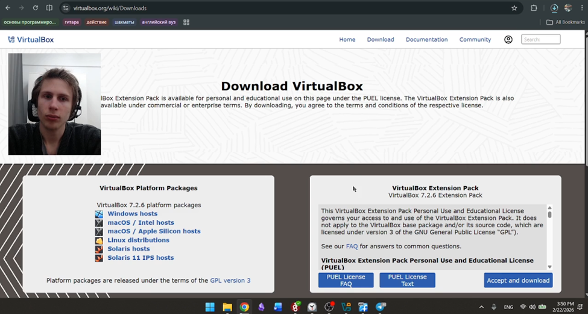
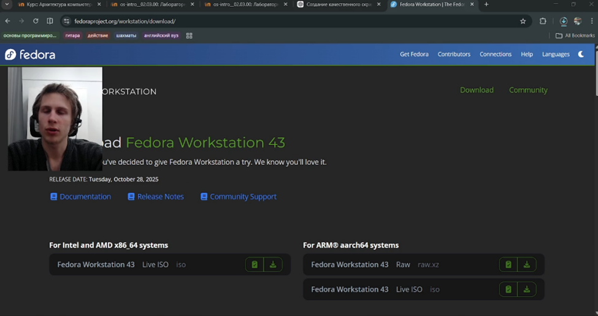
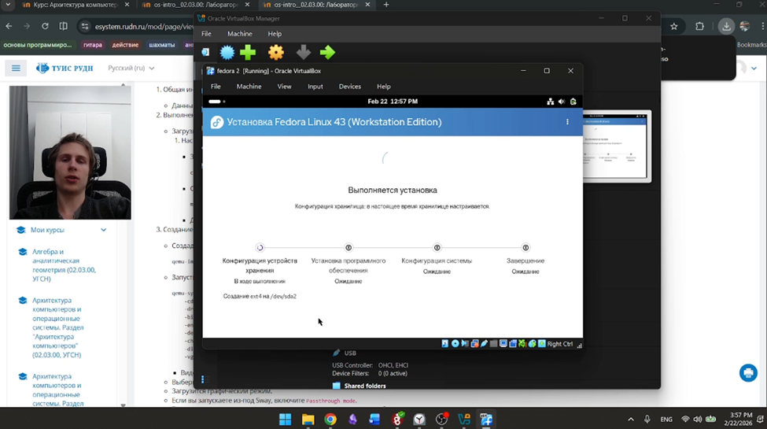
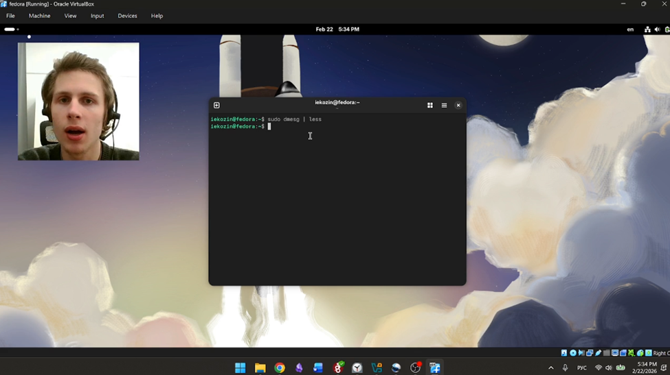
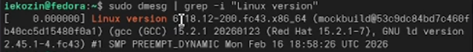
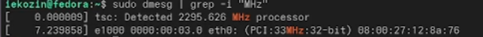
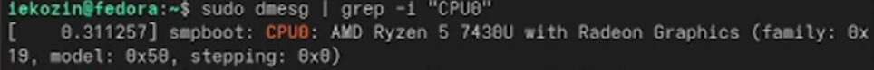
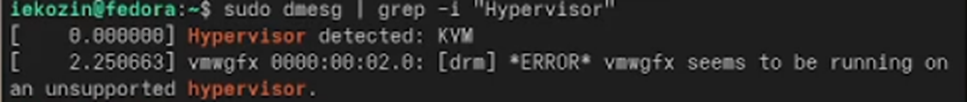
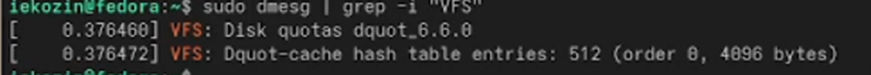
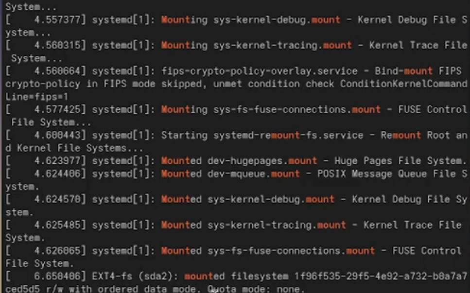

# Лабораторная работа №1  
## Архитектура компьютеров и операционные системы  
### Раздел «Операционные системы»

**Выполнил:** Козин Иван Евгеньевич  
**Группа:** НКАбд-03-25  

---

# Цель работы

Приобретение практических навыков:

- установки операционной системы на виртуальную машину  
- первичной настройки системы  
- получения базовой информации о конфигурации ОС  

---

# 1. Установка VirtualBox

Была установлена программа VirtualBox и создана виртуальная машина.

---

<!-- _class: img -->

---

# 2. Установка Fedora Linux

- Скачан ISO-образ Fedora Linux  
- ISO подключён к виртуальной машине  
- Система запущена в Live-режиме  

---

<!-- _class: img -->

---

# Подготовка системы

В Live-режиме выполнена подготовка среды для дальнейшей работы.

---

<!-- _class: img -->

---

# Получение информации о системе

Были определены:

- версия ядра Linux  
- модель и частота процессора  
- объём оперативной памяти  
- тип гипервизора  
- тип файловой системы корневого раздела  
- последовательность монтирования файловых систем  

---

<!-- _class: img -->

---

# Версия ядра Linux

---

<!-- _class: img -->

---

# Частота процессора

---

<!-- _class: img -->

---

# Модель процессора

---

<!-- _class: img -->

---

# Объём оперативной памяти

---

<!-- _class: img -->

---

# Тип гипервизора

---

<!-- _class: img -->

---

# Тип файловой системы корневого раздела

---

<!-- _class: img -->

---

# Последовательность монтирования ФС

---

<!-- _class: img -->

---

<!-- _class: img -->

---

# Контрольные вопросы

- Учётная запись пользователя  
- Основные команды терминала  
- Файловая система  
- Подмонтированные ФС  
- Удаление зависшего процесса  

---

# Вывод

- Установлена Fedora Linux в VirtualBox  
- Получена системная информация (ядро, CPU, RAM, ФС, гипервизор)  
- Закреплены базовые команды Linux  
- Освоены принципы работы с процессами и файловыми системами  

---

# Спасибо за внимание