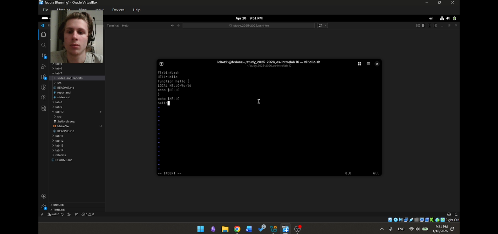
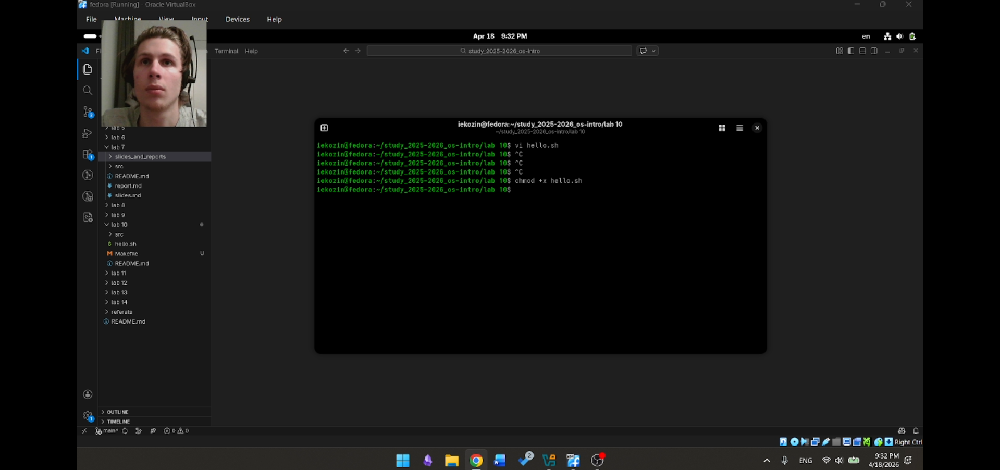
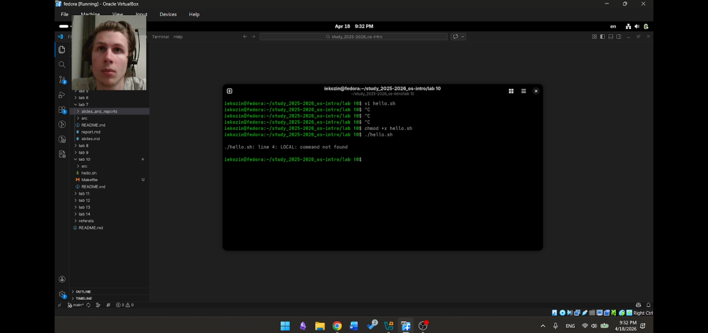
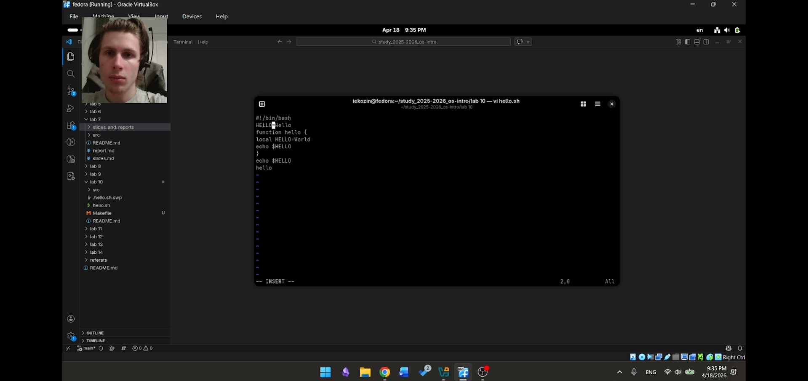
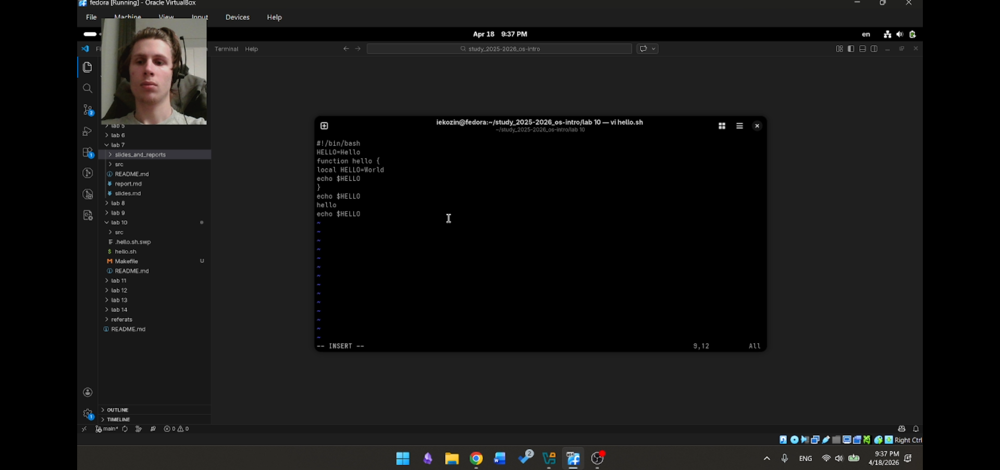
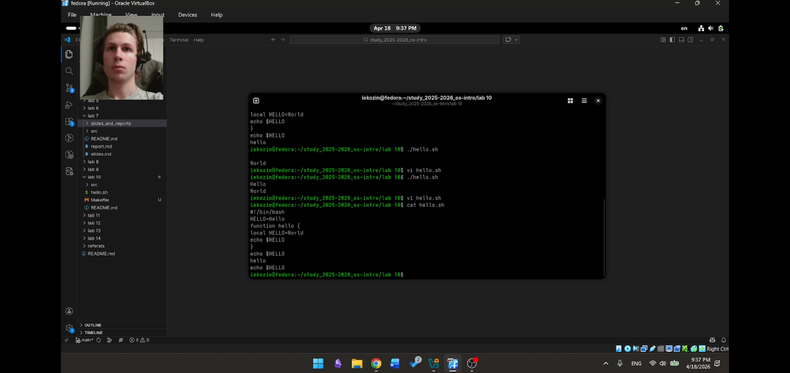
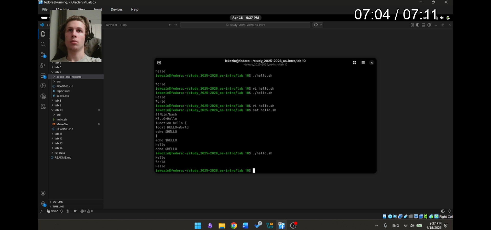

# Лабораторная работа №10  
## Текстовый редактор vi  

Козин Иван Евгеньевич  
НКАбд-03-25  

---

# Цель работы

Познакомиться с Linux  
и освоить редактор vi  

---

# Задачи

- изучить vi  
- освоить режимы  
- создать и изменить файл  

---

# Что такое vi

vi — текстовый редактор Linux  

Используется для:
- создания файлов  
- редактирования  

---

# Режимы vi

1. Командный  
2. Вставки  
3. Последней строки  

---

# Командный режим

- перемещение  
- удаление  
- команды  

Примеры:  
dd — удалить строку  
u — отмена  

---

# Режим вставки

Переход: i  

Выход: Esc  

---

# Режим последней строки

Команды:  
:w  
:wq  
:q!  

---

# Создание каталога

mkdir -p ~/work/os/lab06  
cd ~/work/os/lab06  



---

# Создание файла

vi hello.sh  

```
#!/bin/bash  
HELL=Hello  
function hello {  
LOCAL HELLO=World  
echo $HELLO  
}  
echo $HELLO  
hello  

```



---

# Сохранение

:wq  
chmod +x hello.sh  



---

# Первый запуск

./hello.sh  

Ошибка:  
LOCAL: command not found  



---

# Редактирование

vi hello.sh  

Исправления:  
HELL → HELLO  
LOCAL → local  



---

# Добавление строки

echo $HELLO  

Команды:  
o  
dd  
u  



---

# Итоговый файл
```
#!/bin/bash  
HELLO=Hello  
function hello {  
local HELLO=World  
echo $HELLO  
}  
echo $HELLO  
hello  
echo $HELLO  
```
---

# Финальный запуск

./hello.sh  

Результат:  
Hello  
World  
Hello  



---

# Вывод

- изучен vi  
- освоены режимы  
- получены навыки редактирования  

vi — важный инструмент Linux  

---