

# Лабораторная работа №3
## Архитектура компьютеров и операционные системы  
### Раздел «Операционные системы»

**Тема:** Первоначальная настройка Git  

**Выполнил:** Козин Иван Евгеньевич  
**Группа:** НКАбд-03-25  

---

# Цель работы

Освоить практические навыки:

- базовой настройки Git  
- настройки учёта переносов строк  
- создания SSH-ключей и подключения к GitHub  
- создания PGP-ключа и подписи коммитов  
- настройки GitHub CLI (gh)  
- создания репозитория по шаблону и первичной структуры курса  

---

# Что было сделано

1. Установлены Git и gh  
2. Выполнена базовая настройка Git  
3. Созданы SSH ключи (rsa 4096, ed25519)  
4. Создан PGP ключ и добавлен в GitHub  
5. Включена подпись коммитов Git  
6. Настроен gh и выполнен вход  
7. Создан репозиторий курса по шаблону и настроена структура  

---

# 1. Установка Git

Git установлен через пакетный менеджер.

---

<!-- _class: img -->
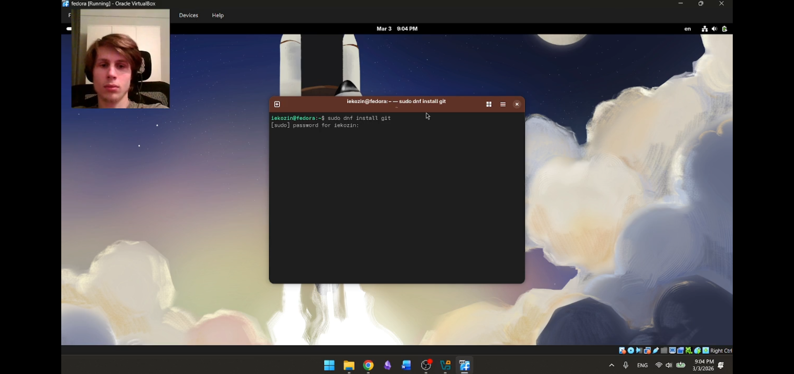

---

# 2. Установка GitHub CLI (gh)

Установлена утилита **gh** для работы с GitHub через терминал.

---

<!-- _class: img -->
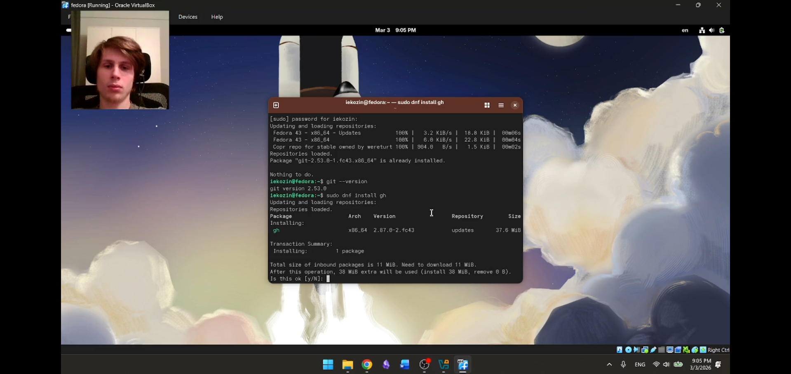

---

# 3. Базовая настройка Git

Выполнены настройки:

- user.name / user.email  
- core.quotepath  
- init.defaultBranch  
- core.autocrlf / core.safecrlf  

---

<!-- _class: img -->
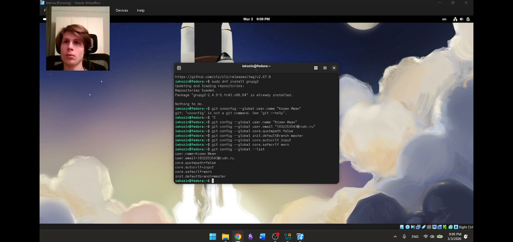

---

# 4. Создание SSH ключей

Созданы два ключа:

- RSA 4096  
- Ed25519  

---

<!-- _class: img -->
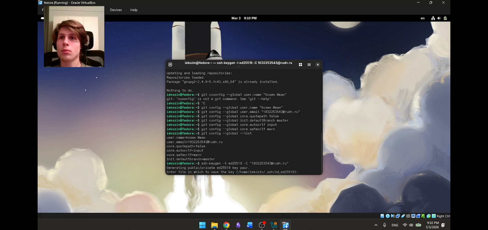

---

# 5. Создание PGP ключа

Сгенерирован GPG/PGP ключ (RSA 4096) для подписи коммитов.

---

<!-- _class: img -->
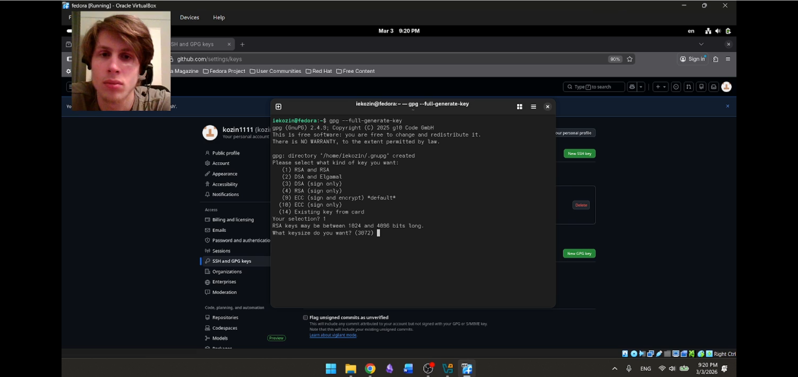

---

# 6. Настройка GitHub

Создана/использована учётная запись GitHub и выполнены настройки профиля.

---

<!-- _class: img -->
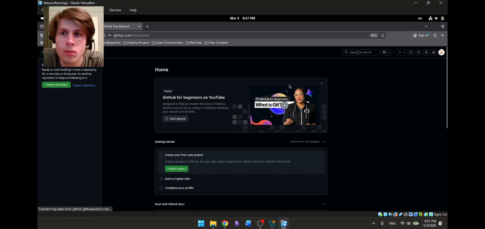

---

# 7. Добавление PGP ключа в GitHub

- получен отпечаток ключа  
- экспортирован публичный ключ  
- добавлен в GitHub (GPG keys)  

---

<!-- _class: img -->
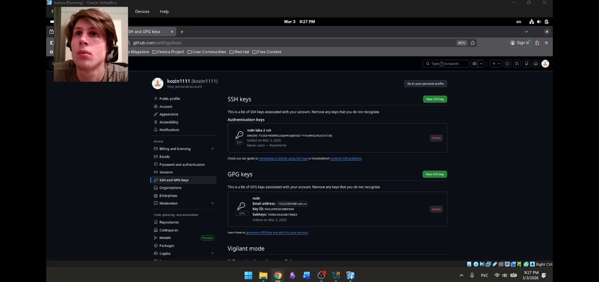

---

# 8. Настройка подписи коммитов

Включена автоматическая подпись коммитов:

- user.signingkey  
- commit.gpgsign true  
- gpg.program  

---

<!-- _class: img -->
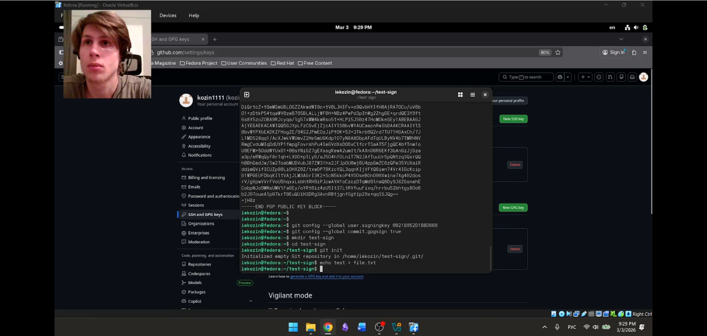

---

# 9. Настройка gh

Выполнена авторизация:

- `gh auth login`  
- вход через браузер  

---

<!-- _class: img -->
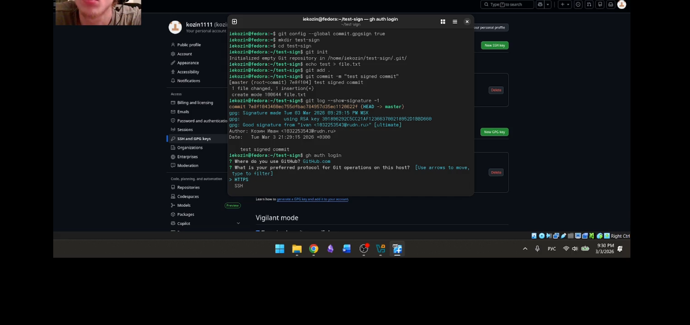

---

# 10. Создание репозитория курса по шаблону

- создан репозиторий на основе шаблона  
- выполнено клонирование `--recursive`  

---

<!-- _class: img -->
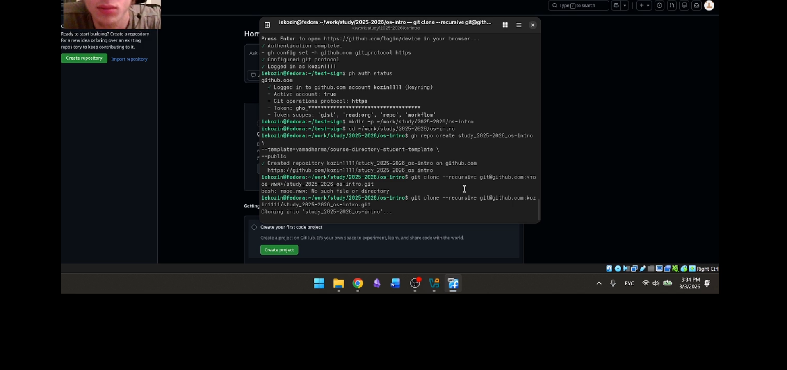

---

# 11. Настройка структуры каталога курса

Выполнены действия:

- удалён `package.json`  
- создан файл `COURSE`  
- выполнен `make`  
- сделан коммит и `git push`  

---

<!-- _class: img -->
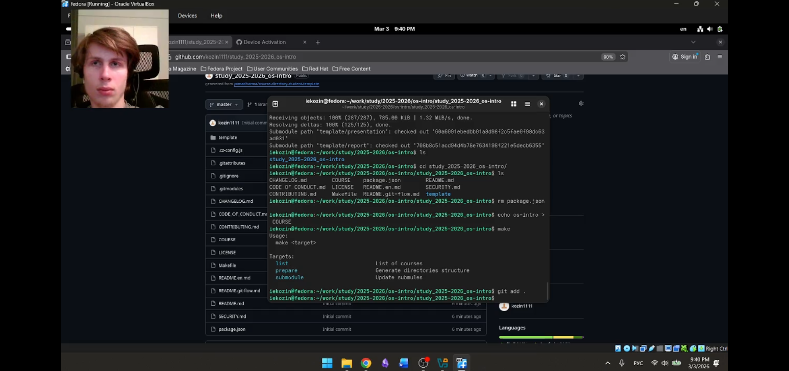

---

# Контрольные вопросы (кратко)

- Что такое VCS и зачем нужна  
- Commit / история / репозиторий / рабочая копия  
- Централизованные vs распределённые VCS  
- Порядок работы с общим репозиторием  
- Основные команды Git  
- Ветки и их назначение  
- `.gitignore` и исключение файлов из коммитов  

---

# Вывод

- Установлены Git и gh  
- Выполнена базовая настройка Git и переносов строк  
- Созданы SSH и PGP ключи, настроена подпись коммитов  
- Настроен GitHub и выполнена авторизация gh  
- Создан репозиторий курса по шаблону и подготовлена структура проекта  

---

# Спасибо за внимание