<style>
section.img {
  display: flex;
  justify-content: center;
  align-items: center;
  text-align: center;
}
section.img img {
  display: block;
  margin: auto;
  max-width: 90%;
  max-height: 90%;
}
</style>

# Лабораторная работа №4
## Архитектура компьютеров и операционные системы  
### Раздел «Операционные системы»

**Тема:** Продвинутое использование Git (Gitflow, SemVer, Conventional Commits)

**Выполнил:** Козин Иван Евгеньевич  
**Группа:** НКАбд-03-25  

---

# Цель работы

Освоить практические навыки:

- работы по модели ветвления **Gitflow**
- применения **семантического версионирования (SemVer)**
- использования **Conventional Commits**
- установки и настройки инструментов: **git-flow, Node.js, pnpm, commitizen, standard-changelog**
- создания **релиза** и формирования **CHANGELOG.md**
- публикации **GitHub Release**

---

# Что было сделано

1. Установлен **git-flow**
2. Установлены **Node.js** и **pnpm**
3. Установлены инструменты **commitizen** и **standard-changelog**
4. Настроен `package.json` для Conventional Commits
5. Инициализирован **Gitflow**
6. Создан релиз **1.0.0**
7. Сформирован журнал изменений **CHANGELOG.md**
8. Отправлены ветки и теги в удалённый репозиторий

---

# 1. Установка git-flow

Gitflow установлен через Copr репозиторий Fedora.

```
dnf copr enable elegos/gitflow
dnf install gitflow
```

---

<!-- _class: img -->
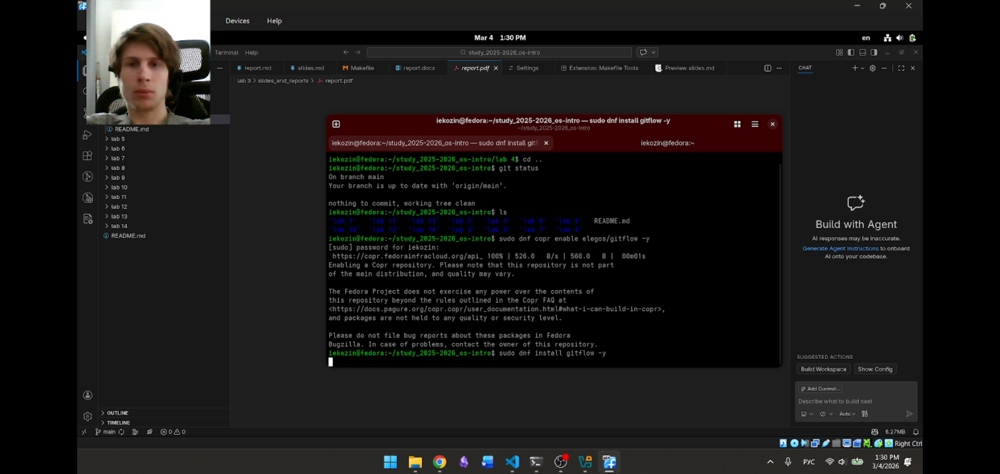

---

# 2. Установка Node.js

Node.js используется для работы инструментов семантического версионирования.

```
dnf install nodejs
dnf install pnpm
```

---

<!-- _class: img -->
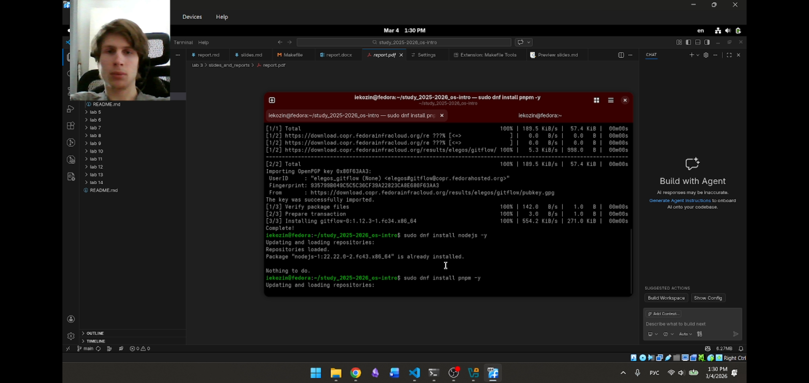

---

# 3. Настройка pnpm

Настроена переменная PATH для работы pnpm.

```
pnpm setup
source ~/.bashrc
```

---

<!-- _class: img -->
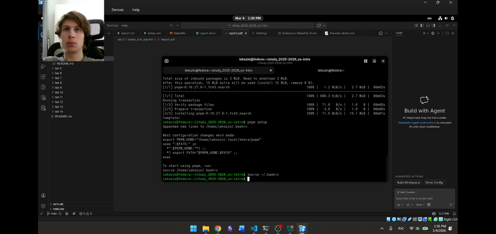

---

# 4. Установка commitizen

Инструмент **commitizen** используется для создания коммитов по стандарту Conventional Commits.

```
pnpm add -g commitizen
```

Коммиты выполняются через:

```
git cz
```

---

<!-- _class: img -->


---

# 5. Установка standard-changelog

Инструмент используется для генерации журнала изменений.

```
pnpm add -g standard-changelog
```

---

<!-- _class: img -->
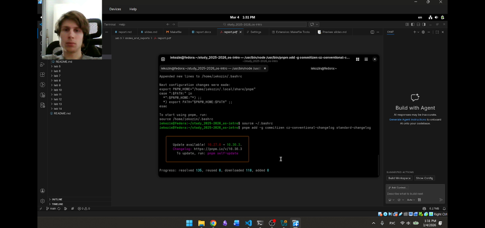

---

# 6. Создание репозитория

Инициализация репозитория и подключение GitHub.

```
git init
git add .
git commit -m "first commit"
git remote add origin git@github.com:<username>/git-extended.git
git push -u origin main
```

---

<!-- _class: img -->
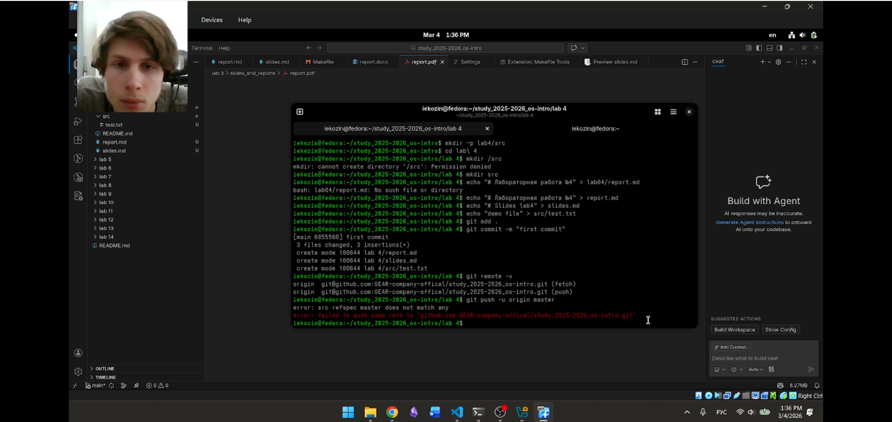

---

<!-- _class: img -->
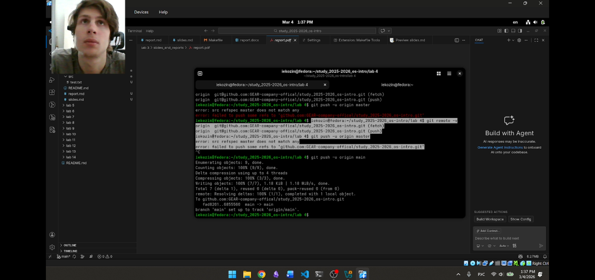

---

# 7. Настройка Conventional Commits

Создан файл **package.json**.

```
pnpm init
```

Добавлена конфигурация commitizen:

```json
{
 "config": {
   "commitizen": {
     "path": "cz-conventional-changelog"
   }
 }
}
```

После настройки коммиты выполняются через:

```
git cz
```

---

<!-- _class: img -->
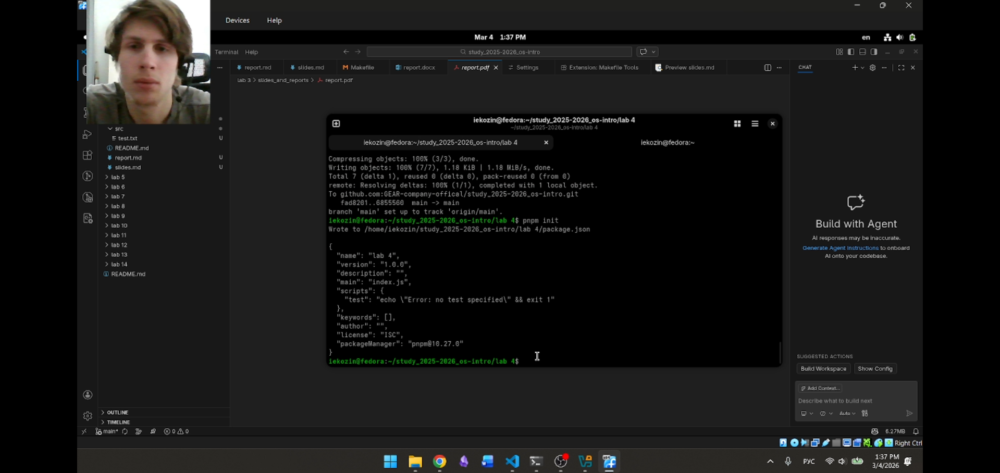

---

<!-- _class: img -->
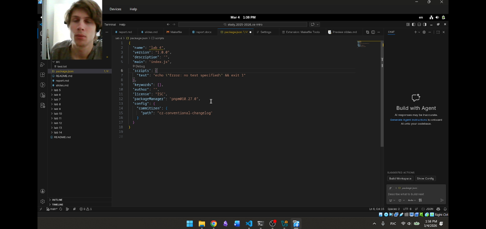

---

# 8. Инициализация Gitflow

Инициализация структуры ветвления.

```
git flow init
```

Создаются ветки:

- main
- develop

---

<!-- _class: img -->
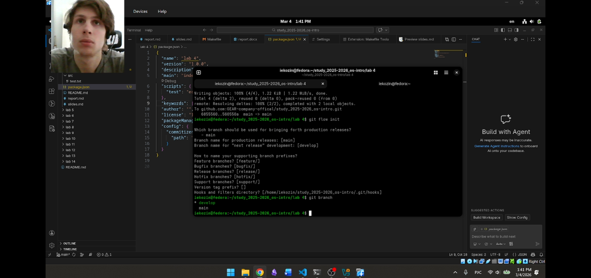

---

# 9. Создание релиза

Создание ветки релиза:

```
git flow release start 1.0.0
```

Генерация журнала изменений:

```
standard-changelog --first-release
```

Добавление файла:

```
git add CHANGELOG.md
git commit -m "chore(site): add changelog"
```

Завершение релиза:

```
git flow release finish 1.0.0
```

Отправка изменений:

```
git push --all
git push --tags
```

---

<!-- _class: img -->
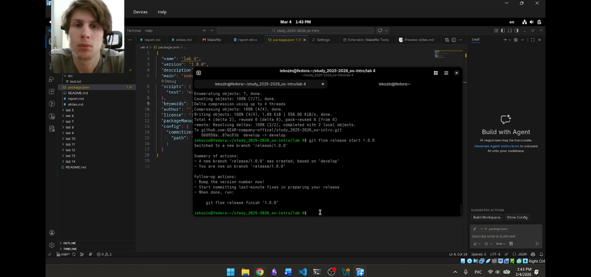

---

<!-- _class: img -->
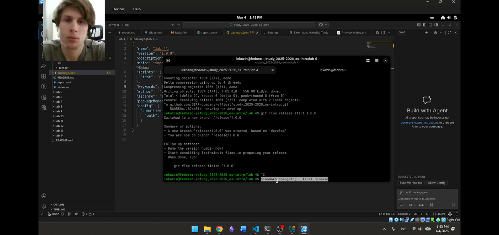

---

<!-- _class: img -->
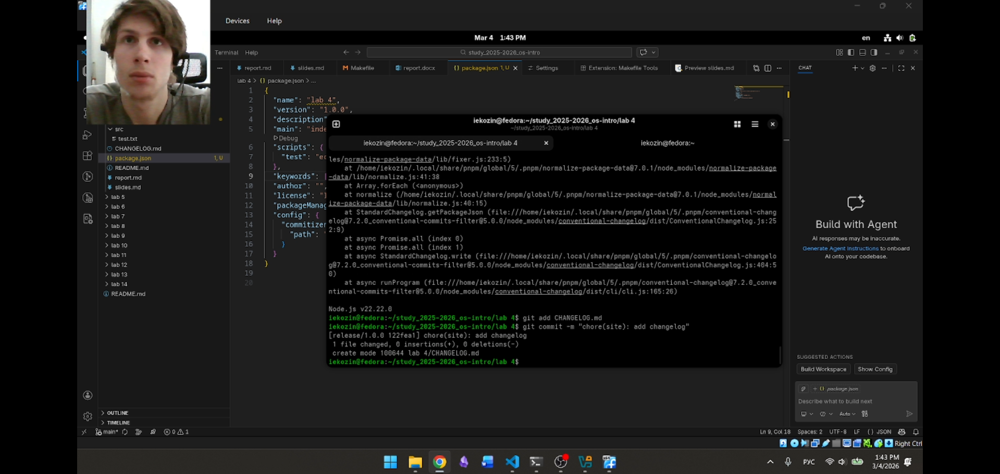

---

<!-- _class: img -->
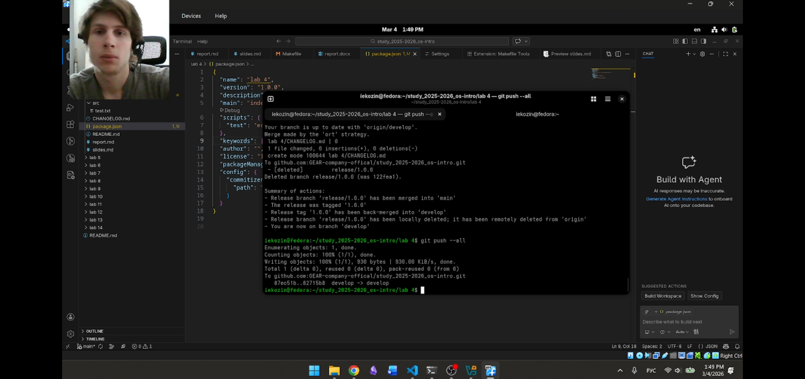

---

# 10. Создание релиза на GitHub

Создание релиза через GitHub CLI.

```
gh release create v1.0.0 -F CHANGELOG.md
```

---

<!-- _class: img -->
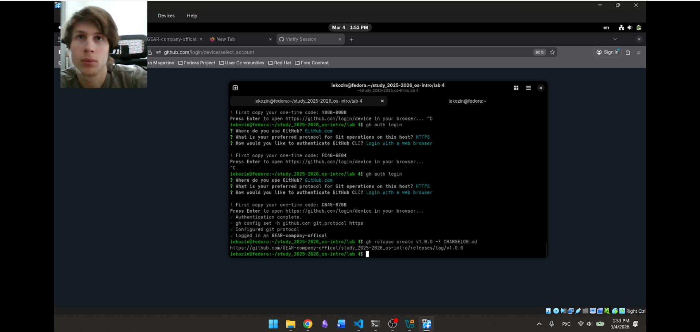

---

# Теоретические положения

**Gitflow**

- main — стабильная версия проекта
- develop — основная ветка разработки
- feature — разработка новых функций
- release — подготовка релиза
- hotfix — исправления ошибок

**SemVer**

Версия имеет вид:

```
MAJOR.MINOR.PATCH
```

**Conventional Commits**

Структура коммита:

```
type(scope): subject
```

Примеры:

- feat: новая функция
- fix: исправление ошибки
- docs: изменение документации
- chore: технические изменения

---

# Вывод

В ходе лабораторной работы была изучена модель ветвления Gitflow и её применение 
при разработке программных проектов.

Были освоены принципы семантического версионирования и использования стандарта 
Conventional Commits. Также были установлены инструменты автоматизации работы 
с коммитами и журналом изменений.

Полученные знания позволяют эффективно организовывать процесс разработки 
и управления версиями программного обеспечения.

---

# Спасибо за внимание