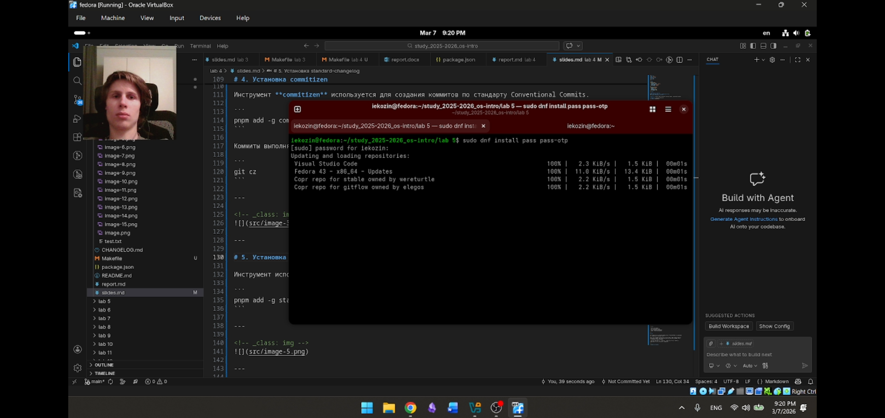
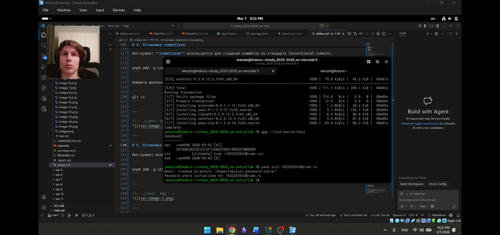
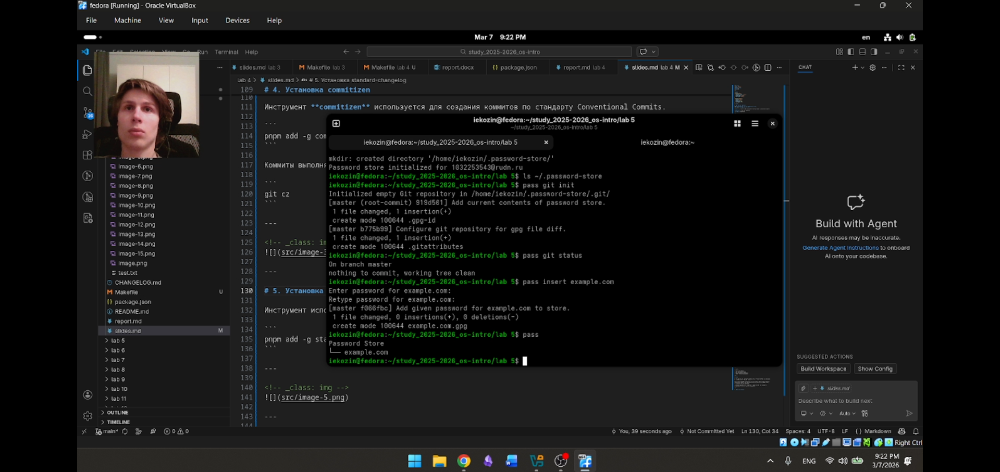
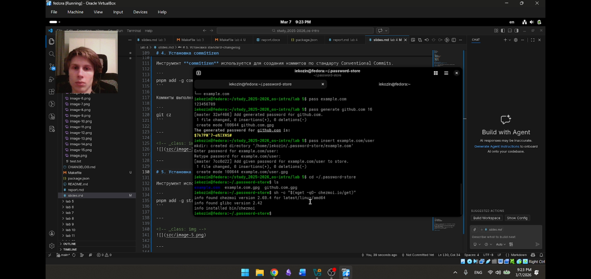
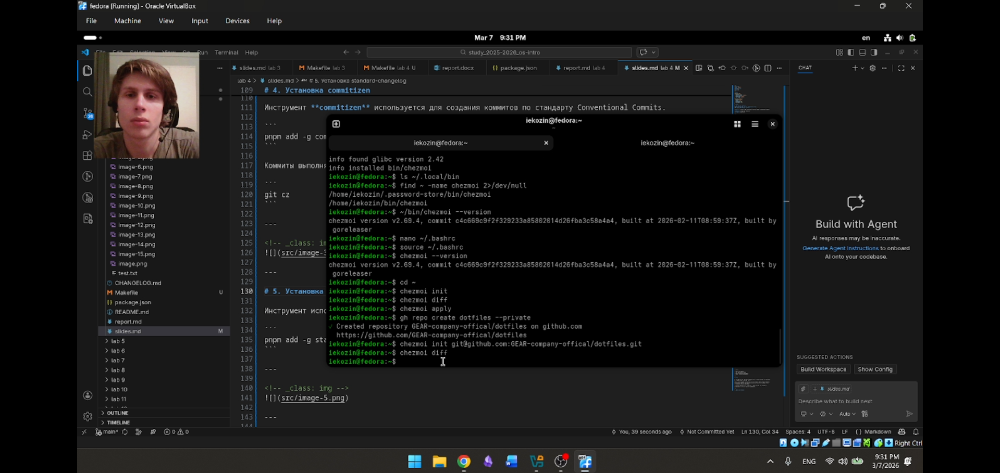
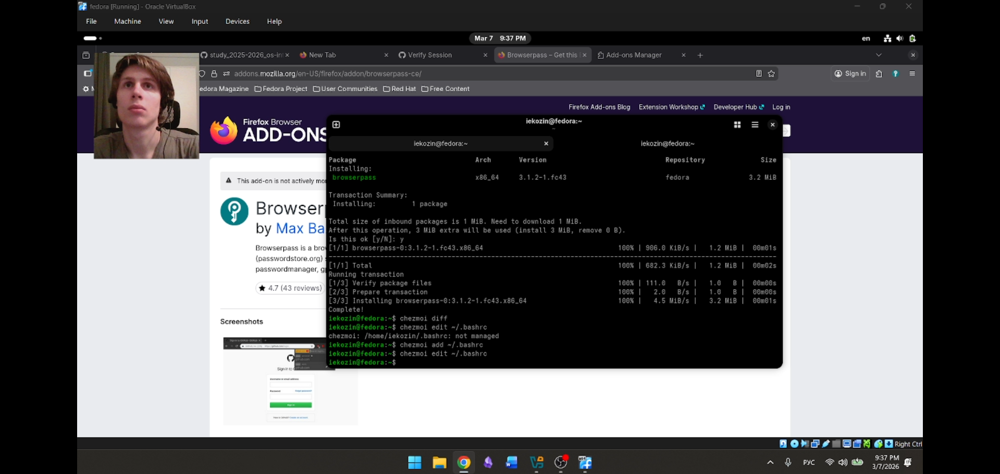

# Отчёт  
## Лабораторная работа №5  
### Архитектура компьютеров и операционные системы

**Выполнил:** Козин Иван Евгеньевич  
**Группа:** НКАбд-03-25  

---

# Цель работы

Изучить менеджер паролей **pass**, а также освоить управление файлами конфигурации с помощью программы **chezmoi**.

---

# Задание

В ходе лабораторной работы необходимо:

- изучить менеджер паролей pass
- установить и настроить pass
- создать и использовать базу паролей
- изучить управление конфигурационными файлами
- установить и настроить программу chezmoi
- создать собственный репозиторий конфигурационных файлов
- настроить синхронизацию конфигураций

---

# Теоретические сведения

## Менеджер паролей pass

Менеджер паролей **pass** является стандартным менеджером паролей для Unix-систем и реализован в соответствии с философией Unix.  

Основная идея программы заключается в хранении паролей в файловой системе в виде отдельных файлов, которые шифруются с помощью **GPG**.

Все пароли располагаются в каталоге:

```
~/.password-store
```

Каждый пароль хранится в отдельном файле с расширением **.gpg**.

---

## Структура базы паролей

Структура базы данных паролей может быть произвольной и задаётся пользователем.

Примеры структуры:

```
example.com.pgp
example.com/user.pgp
user@example.com.pgp
example.com:22/user.pgp
```

Такая структура позволяет удобно организовать хранение данных для различных сервисов, пользователей и портов.

---

## Управление конфигурациями с помощью chezmoi

Программа **chezmoi** используется для управления конфигурационными файлами пользователя.

Она позволяет хранить конфигурационные файлы в Git-репозитории и синхронизировать их между различными компьютерами.

Рабочий каталог chezmoi:

```
~/.local/share/chezmoi
```

Для применения конфигурации используется команда:

```
chezmoi apply
```

---

# Выполнение лабораторной работы

## Установка менеджера паролей pass

Для установки менеджера паролей используется менеджер пакетов Fedora.

```
sudo dnf install pass pass-otp
```




---

## Создание и проверка GPG ключа

Для работы pass требуется наличие GPG-ключа.

Проверка существующих ключей:

```
gpg --list-secret-keys
```

Если ключ отсутствует, его можно создать командой:

```
gpg --full-generate-key
```



---

## Инициализация хранилища паролей

После создания ключа инициализируем хранилище pass.

```
pass init user@email
```

В результате создаётся каталог:

```
~/.password-store
```


---

## Добавление пароля

Добавим новый пароль в хранилище.

```
pass insert example.com
```

После ввода пароль сохраняется в зашифрованном виде.

Для просмотра сохранённого пароля используется команда:

```
pass example.com
```


---

## Установка программы chezmoi

Для управления конфигурационными файлами устанавливаем программу chezmoi.

```
sh -c "$(wget -qO- chezmoi.io/get)"
```



---

## Инициализация репозитория конфигураций

Создадим репозиторий конфигурационных файлов.

```
chezmoi init git@github.com:GEAR-company-offical/dotfiles.git
```



---

## Добавление конфигурационного файла

Добавим конфигурационный файл оболочки bash в систему управления chezmoi.

```
chezmoi add ~/.bashrc
```

После добавления применим изменения:

```
chezmoi apply
```



---

# Вывод

В ходе выполнения лабораторной работы был изучен менеджер паролей **pass**, предназначенный для безопасного хранения паролей в зашифрованном виде.

Также была изучена программа **chezmoi**, которая позволяет управлять конфигурационными файлами пользователя и синхронизировать их между различными компьютерами с использованием Git.

Полученные навыки позволяют эффективно управлять конфигурацией пользовательской среды и безопасно хранить учётные данные в операционной системе Linux.