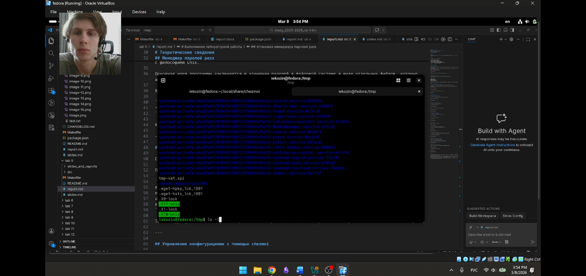
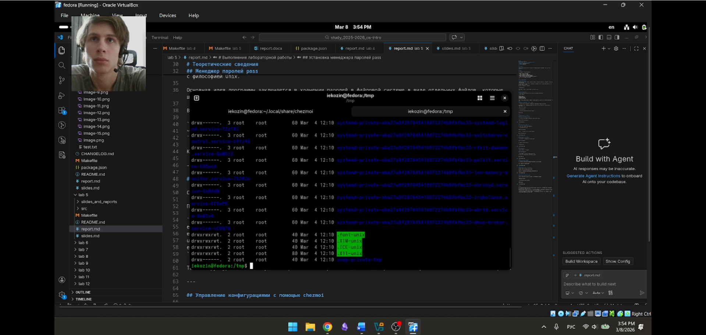

# Отчёт  
## Лабораторная работа №6 
### Архитектура компьютеров и операционные системы

**Выполнил:** Козин Иван Евгеньевич  
**Группа:** НКАбд-03-25  

---

# Цель работы

Приобретение практических навыков взаимодействия пользователя с операционной системой Linux с помощью командной строки.

---

# Задание

В ходе лабораторной работы необходимо:

- изучить основные команды интерфейса командной строки Unix/Linux
- научиться перемещаться по файловой системе
- изучить команды просмотра содержимого каталогов
- освоить создание и удаление каталогов
- изучить использование справочной системы man
- освоить работу с историей команд

---

# Теоретические сведения

В операционных системах семейства Unix и Linux взаимодействие пользователя с системой часто осуществляется с помощью командной строки. Пользователь вводит команды в терминале, после чего операционная система выполняет соответствующие действия.

Команда в системе Unix представляет собой текстовую инструкцию, состоящую из имени команды и аргументов. Имя команды определяет выполняемое действие, а аргументы уточняют параметры выполнения.

Для получения информации о командах используется справочная система `man`. Она позволяет получить описание команды, её параметров и примеров использования.

Основные команды, используемые в работе:

- `pwd` — вывод абсолютного пути текущего каталога
- `cd` — переход между каталогами файловой системы
- `ls` — просмотр содержимого каталога
- `mkdir` — создание каталогов
- `rm` — удаление файлов и каталогов
- `rmdir` — удаление пустых каталогов
- `history` — просмотр ранее выполненных команд

Файловая система Linux имеет иерархическую структуру. Вершиной этой структуры является корневой каталог `/`, от которого отходят все остальные каталоги.

Для сокращения записи путей используются специальные обозначения:

- `~` — домашний каталог пользователя
- `.` — текущий каталог
- `..` — родительский каталог

---

# Выполнение работы

## 1. Определение домашнего каталога

С помощью команды `pwd` был определён полный путь текущего каталога пользователя.

```
pwd
```

Результат выполнения команды показывает абсолютный путь домашнего каталога пользователя.


---

## 2. Работа с системными каталогами

### 2.1 Переход в каталог /tmp

С помощью команды `cd` был выполнен переход в каталог `/tmp`.

```
cd /tmp
pwd
```

Команда `pwd` позволяет убедиться, что переход был выполнен успешно.


---

### 2.2 Просмотр содержимого каталога

Содержимое каталога было просмотрено с помощью команды `ls`.

```
ls
```

Также были использованы дополнительные опции команды.

```
ls -a
ls -l
ls -alF
```

Опции позволяют:

- `-a` — отображать скрытые файлы
- `-l` — выводить подробную информацию о файлах
- `-F` — показывать тип объектов файловой системы






---

### 2.3 Проверка существования каталога cron

Было проверено наличие подкаталога `cron` в каталоге `/var/spool`.

```
ls /var/spool
ls /var/spool | grep cron
```

Команда `grep` позволяет отфильтровать вывод и найти нужный каталог.


---

### 2.4 Просмотр домашнего каталога

Был выполнен переход в домашний каталог пользователя.

```
cd ~
pwd
ls -l
```

Команда `ls -l` выводит подробную информацию о файлах, включая владельца.


---

## 3. Создание и удаление каталогов

### 3.1 Создание каталога newdir

В домашнем каталоге был создан новый каталог `newdir`.

```
mkdir newdir
ls
```


---

### 3.2 Создание подкаталога morefun

В каталоге `newdir` был создан подкаталог `morefun`.

```
mkdir ~/newdir/morefun
```


---

### 3.3 Создание нескольких каталогов одной командой

Были созданы три каталога одной командой.

```
mkdir letters memos misk
ls
```

После этого каталоги были удалены одной командой.

```
rm -r letters memos misk
```


---

### 3.4 Попытка удаления каталога newdir

Была выполнена попытка удалить каталог `newdir` командой `rm`.

```
rm newdir
```

Команда не выполняется, так как `rm` без параметров не удаляет каталоги.


---

### 3.5 Удаление каталога morefun

Подкаталог `morefun` был удалён с помощью параметра `-r`.

```
rm -r ~/newdir/morefun
ls ~/newdir
```


---

## 4. Использование справочной системы

С помощью команды `man` была изучена документация команды `ls`.

```
man ls
```

В результате было установлено, что опция `-R` позволяет рекурсивно отображать содержимое каталогов.

```
ls -R
```


---

## 5. Сортировка файлов по времени изменения

С помощью справочной системы было установлено, что для сортировки файлов по времени изменения используется опция `-t`.

```
ls -lt
```


---

## 6. Изучение документации команд

С помощью команды `man` была просмотрена документация следующих команд:

```
man cd
man pwd
man mkdir
man rmdir
man rm
```

В результате были изучены основные параметры и способы использования данных команд.


---

## 7. Работа с историей команд

Список ранее выполненных команд был получен с помощью команды `history`.

```
history
```

Также была выполнена команда из истории по её номеру.

```
!785
```


---

# Вывод

В ходе выполнения лабораторной работы были изучены основные команды интерфейса командной строки операционной системы Linux. Были получены практические навыки перемещения по файловой системе, просмотра содержимого каталогов, создания и удаления каталогов.

Также была изучена работа со справочной системой `man` и механизм использования истории ранее выполненных команд. Полученные знания позволяют эффективно взаимодействовать с операционной системой Linux через терминал.