<style>
section.img {
  display: flex;
  justify-content: center;
  align-items: center;
  text-align: center;
}
section.img img {
  display: block;
  margin: auto;
  max-width: 90%;
  max-height: 90%;
}
</style>

# Лабораторная работа №6
## Архитектура компьютеров и операционные системы  
### Раздел «Операционные системы»

**Тема:** Основы интерфейса взаимодействия пользователя с системой Unix на уровне командной строки  

**Выполнил:** Козин Иван Евгеньевич  
**Группа:** НКАбд-03-25  

---

# Цель работы

Приобретение практических навыков взаимодействия пользователя с системой Linux с помощью командной строки.

---

# Основные команды Linux

В работе использовались основные команды терминала:

- `pwd` — вывод текущего каталога  
- `cd` — переход между каталогами  
- `ls` — просмотр содержимого каталога  
- `mkdir` — создание каталогов  
- `rm` — удаление файлов и каталогов  
- `history` — просмотр истории команд  
- `man` — получение справки по командам  

---

# 1. Определение текущего каталога

Для определения текущего каталога используется команда:

```
pwd
```

Она выводит абсолютный путь текущего каталога пользователя.

---

<!-- _class: img -->


---

# 2. Переход в каталог

Переход в системный каталог `/tmp` выполняется командой:

```
cd /tmp
```

Проверка текущего каталога:

```
pwd
```

---

<!-- _class: img -->
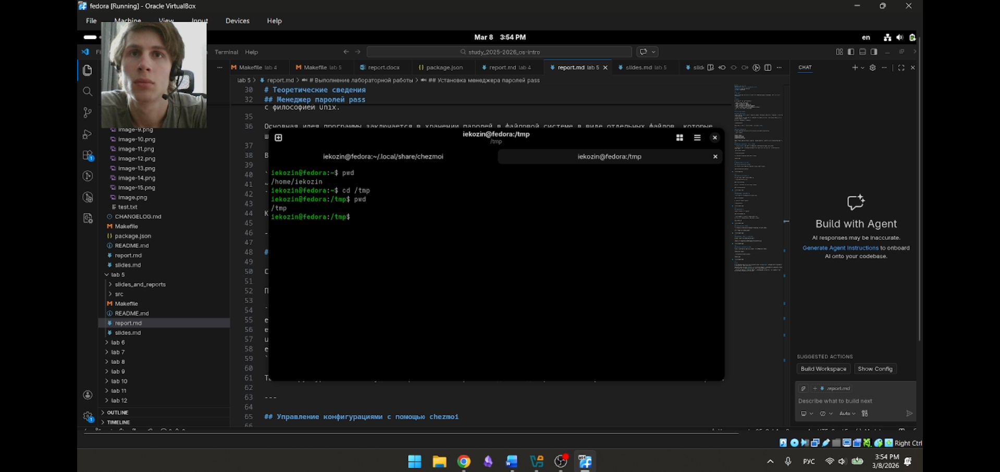

---

# 3. Просмотр содержимого каталога

Для просмотра содержимого используется команда:

```
ls
```

Дополнительные параметры:

```
ls -a
ls -l
ls -alF
```

---

<!-- _class: img -->
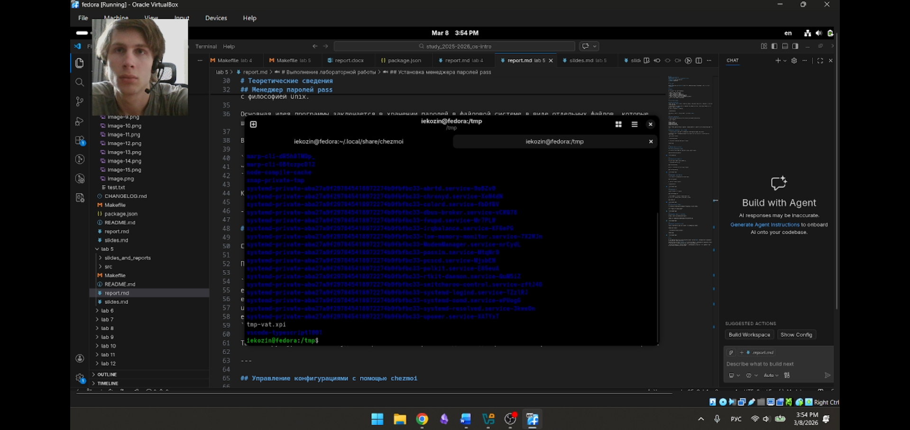

---

<!-- _class: img -->
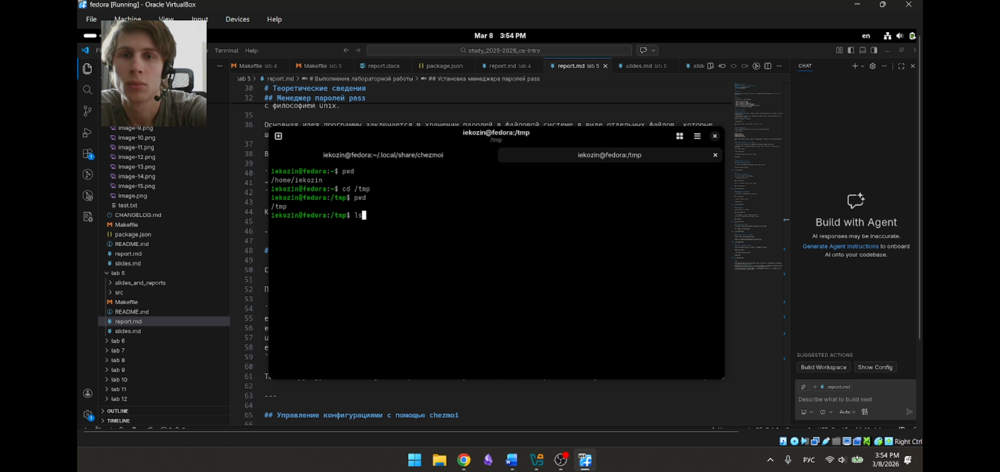

---

<!-- _class: img -->
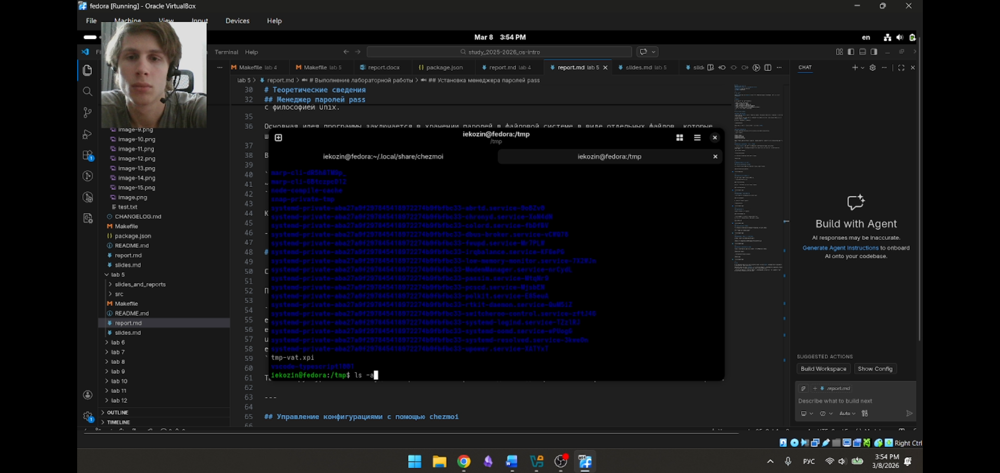

---

<!-- _class: img -->
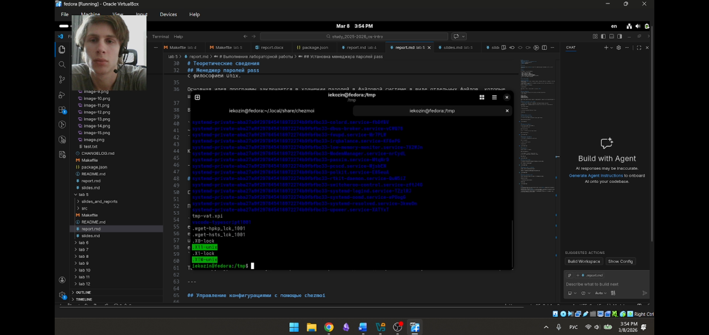

---

# 4. Проверка каталога cron

Проверка существования каталога `cron`:

```
ls /var/spool
ls /var/spool | grep cron
```

Команда `grep` используется для поиска нужной строки.

---

<!-- _class: img -->
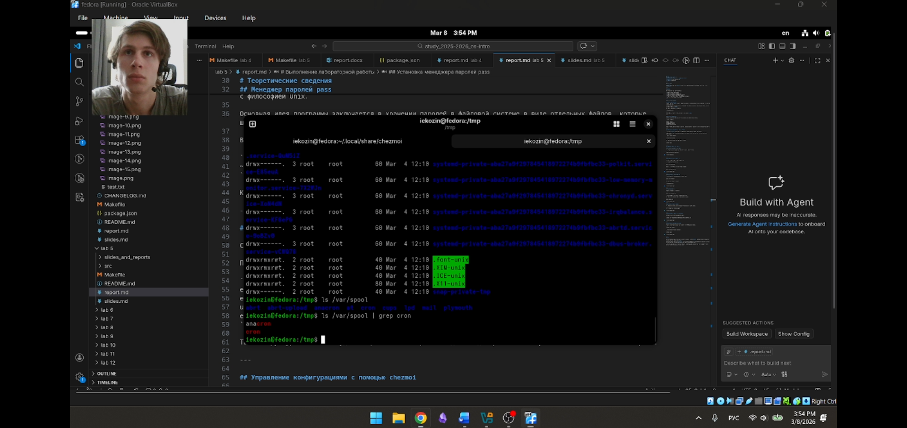

---

# 5. Просмотр домашнего каталога

Переход в домашний каталог пользователя:

```
cd ~
pwd
ls -l
```

Команда `ls -l` показывает подробную информацию о файлах.

---

<!-- _class: img -->
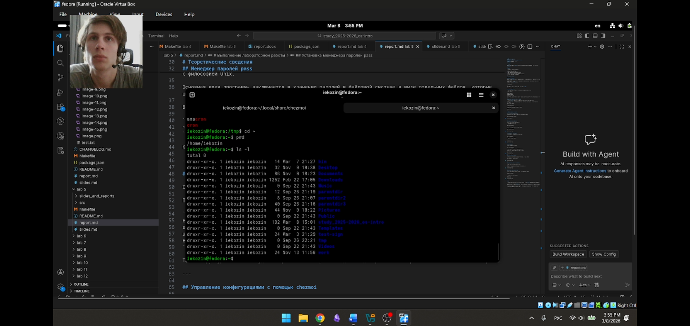

---

# 6. Создание каталогов

Создание нового каталога:

```
mkdir newdir
```

Создание подкаталога:

```
mkdir ~/newdir/morefun
```

---

<!-- _class: img -->
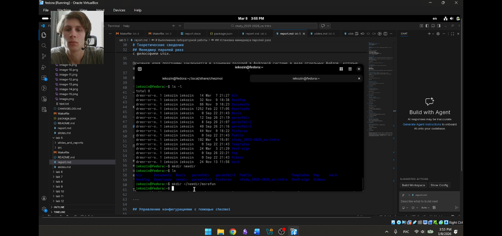

---

<!-- _class: img -->
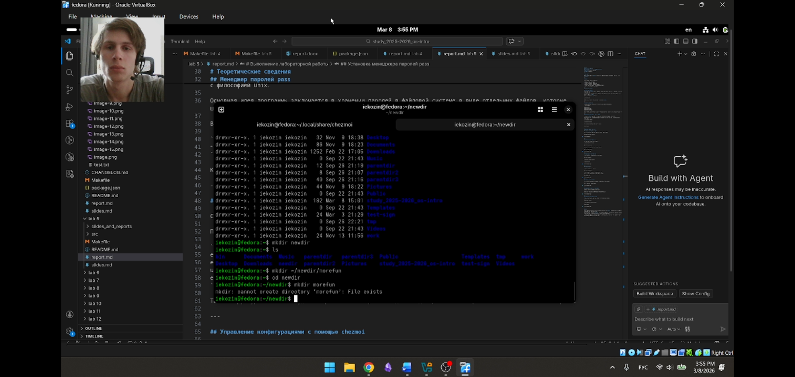

---

# 7. Создание и удаление каталогов

Создание нескольких каталогов:

```
mkdir letters memos misk
```

Удаление каталогов:

```
rm -r letters memos misk
```

---

<!-- _class: img -->
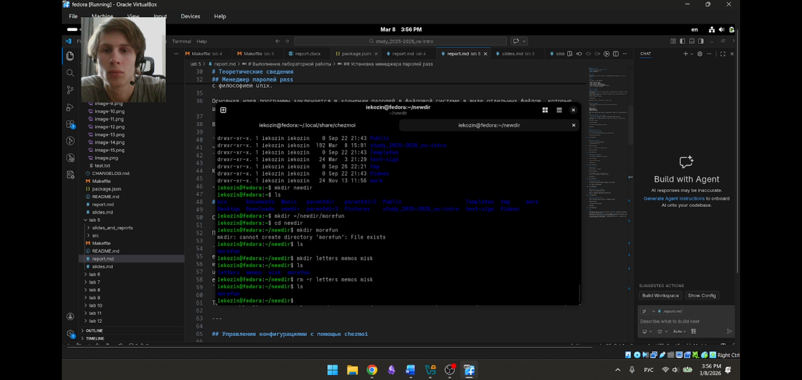

---

# 8. Удаление каталогов

Попытка удаления каталога:

```
rm newdir
```

Удаление каталога с параметром `-r`:

```
rm -r ~/newdir/morefun
```

---

<!-- _class: img -->
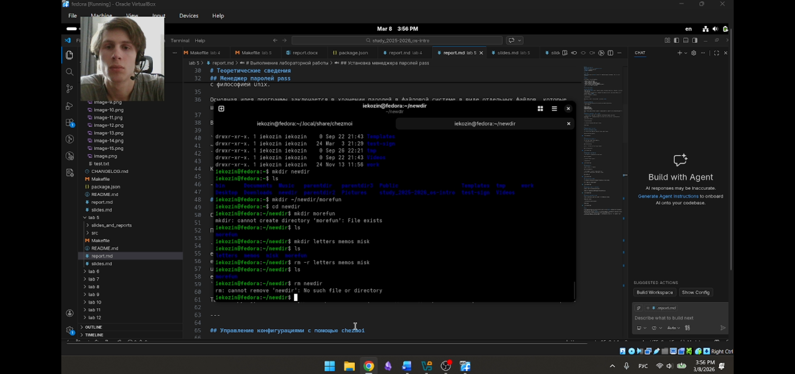

---

<!-- _class: img -->


---

# 9. Использование справочной системы

Получение информации о команде:

```
man ls
```

Пример использования параметра:

```
ls -R
```

---

<!-- _class: img -->
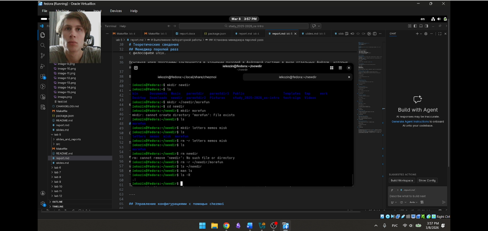

---

# 10. Сортировка файлов

Сортировка файлов по времени изменения:

```
ls -lt
```

---

<!-- _class: img -->
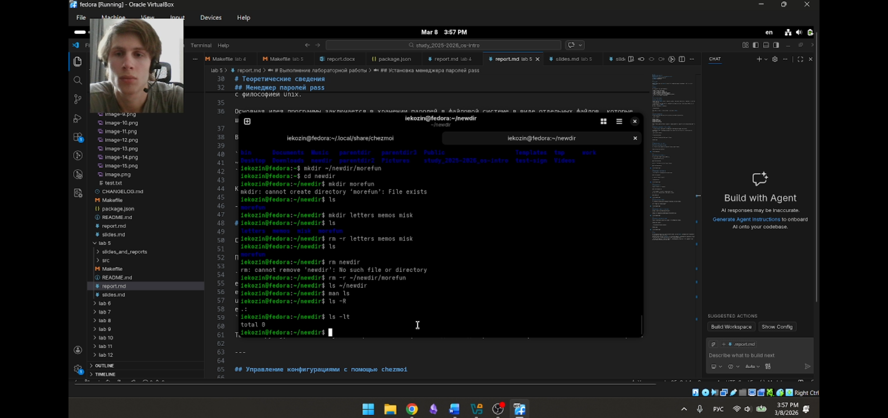

---

# 11. Изучение документации команд

Была изучена документация следующих команд:

```
man cd
man pwd
man mkdir
man rmdir
man rm
```

---

<!-- _class: img -->
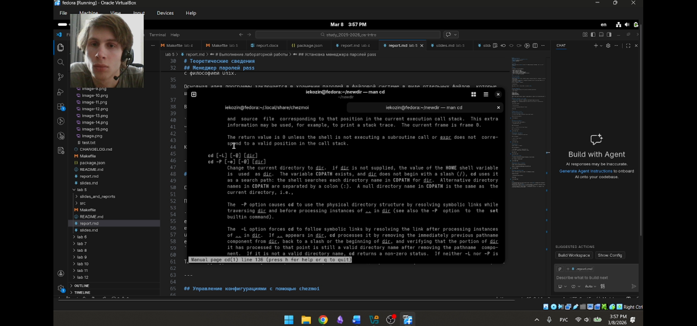

---

# 12. Работа с историей команд

Просмотр истории команд:

```
history
```

Выполнение команды из истории:

```
!785
```

---

<!-- _class: img -->
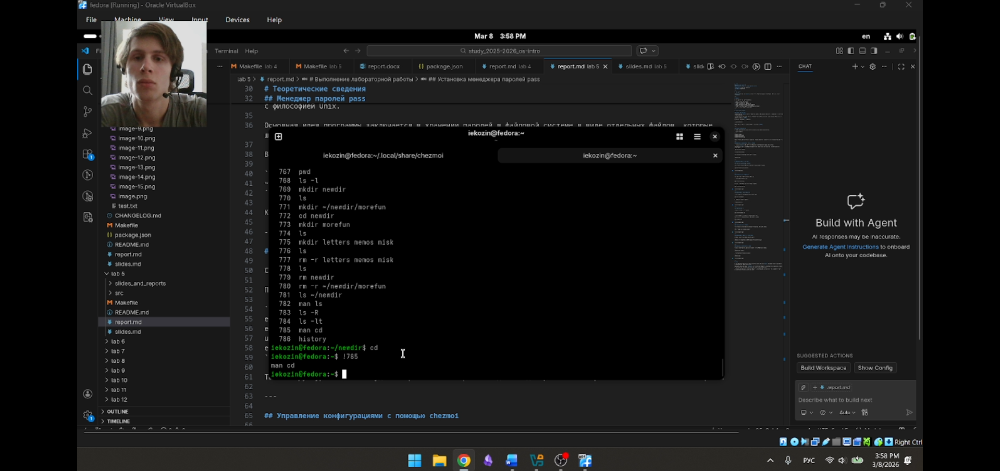

---

# Вывод

- Изучены основные команды командной строки Linux  
- Освоено перемещение по файловой системе  
- Выполнено создание и удаление каталогов  
- Изучена справочная система `man`  
- Освоена работа с историей команд  

---

# Спасибо за внимание