# Отчёт  
## Лабораторная работа №7  
### Архитектура компьютеров и операционные системы

**Выполнил:** Козин Иван Евгеньевич  
**Группа:** НКАбд-03-25  

---

# Цель работы

Ознакомление с файловой системой Linux, её структурой, именами и содержимым каталогов.  
Приобретение практических навыков по применению команд для работы с файлами и каталогами, управлению процессами, проверке использования диска и обслуживанию файловой системы.

---

# Задание

В ходе лабораторной работы необходимо:

- изучить команды для работы с файлами и каталогами (`touch`, `cat`, `less`, `head`, `tail`, `cp`, `mv`, `mkdir`, `rmdir`, `rm`)
- освоить копирование, перемещение и переименование файлов и каталогов
- изучить права доступа и научиться изменять их с помощью команды `chmod`
- провести анализ смонтированных файловых систем с помощью команд `mount`, `df`
- изучить справочную систему `man` для команд `mount`, `fsck`, `mkfs`, `kill`
- выполнить упражнения на установку прав доступа и основные операции с файлами

---

# Теоретические сведения

Файловая система Linux имеет иерархическую структуру, начиная с корневого каталога `/`. Каждому физическому носителю соответствует своя файловая система. Наиболее распространённые типы: ext2/ext3/ext4, ReiserFS, xfs, FAT, NTFS.

**Права доступа** определяют, какие действия может выполнять владелец файла, группа и все остальные пользователи. Они задаются для чтения (r), записи (w) и выполнения (x). Изменяются командой `chmod` в символьном или восьмеричном формате.

Основные команды:

- `touch` — создание пустого файла или обновление времени доступа
- `cat` — вывод содержимого файла
- `less` — постраничный просмотр
- `head` / `tail` — вывод начала или конца файла
- `cp` — копирование файлов и каталогов
- `mv` — перемещение и переименование
- `mkdir` / `rmdir` — создание и удаление каталогов
- `rm` — удаление файлов и каталогов
- `chmod` — изменение прав доступа
- `mount` — просмотр смонтированных файловых систем
- `df` — отчёт об использовании дискового пространства
- `fsck` — проверка целостности файловой системы

---

# Выполнение работы

## 1. Подготовка рабочего окружения

Был создан каталог `play` и файл `feathers` в домашнем каталоге.
cd ~
touch feathers
mkdir play

 

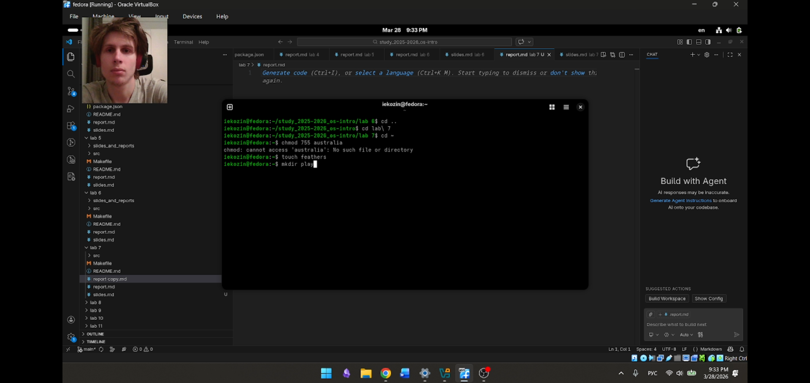

---

## 2. Установка прав доступа для файлов

### 2.1 Каталог `australia` с правами `drwxr--r--` (744)
mkdir australia
chmod 744 australia
ls -ld australia

 

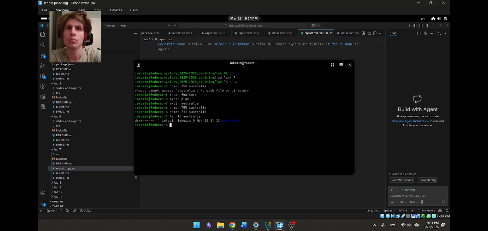

### 2.2 Каталог `play` с правами `drwx--x--x` (711)
chmod 711 play
ls -ld play

 

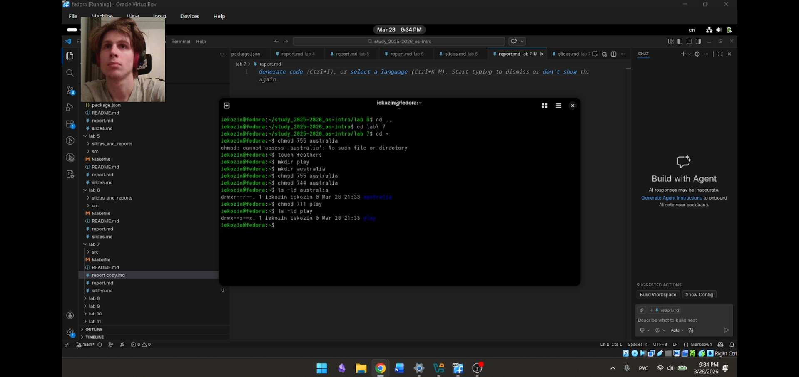

### 2.3 Файл `my_os` с правами `-r-xr--r--` (544)
touch my_os
chmod 544 my_os
ls -l my_os

 

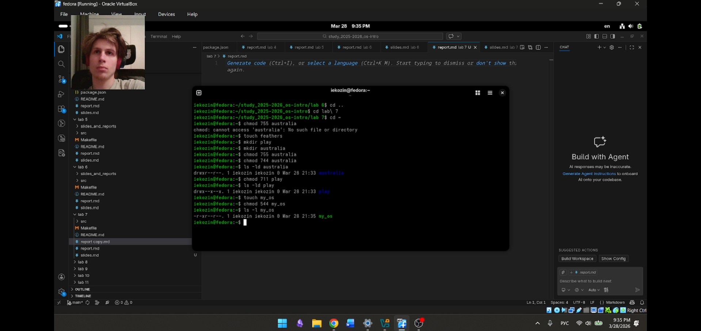

### 2.4 Файл `feathers` с правами `-rw-rw-r--` (664)
chmod 664 feathers
ls -l feathers

 

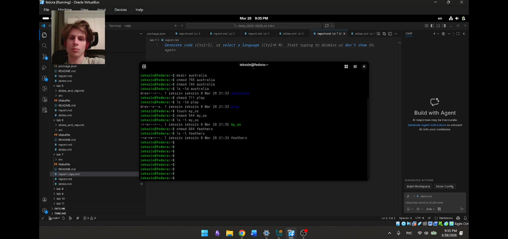

---

## 3. Выполнение упражнений с командами

### 3.1 Просмотр содержимого `/etc/passwd`
cat /etc/passwd

 

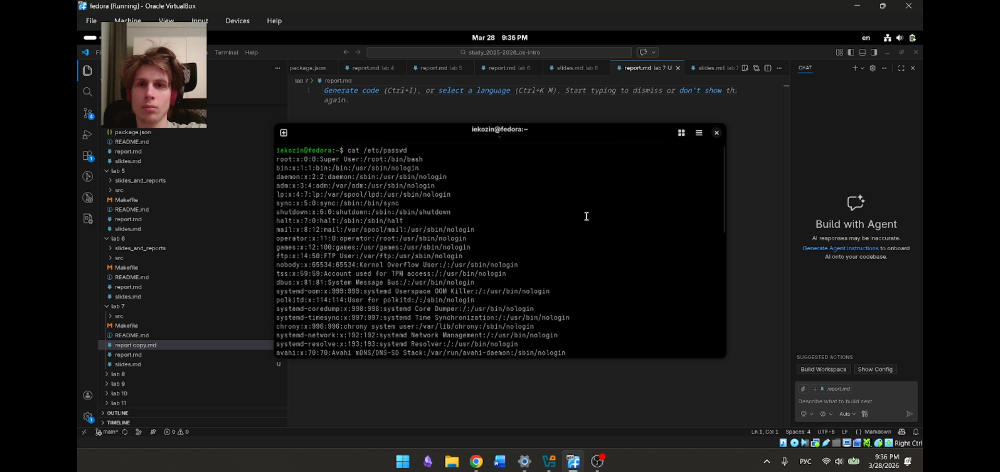

### 3.2 Копирование `feathers` в `file.old`
cp feathers file.old
ls -l file.old

 

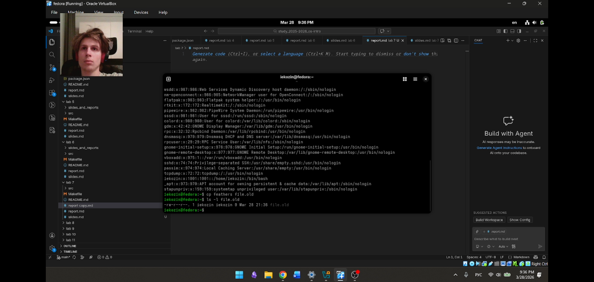

### 3.3 Перемещение `file.old` в каталог `play`
mv file.old play/
ls play/

 

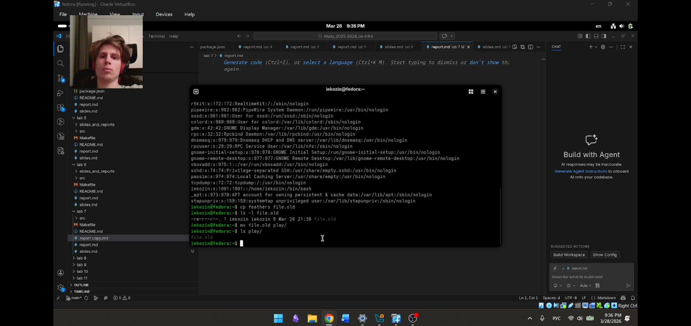
### 3.4 Копирование каталога `play` в `fun`
cp -r play fun
ls -ld fun
ls fun/

 

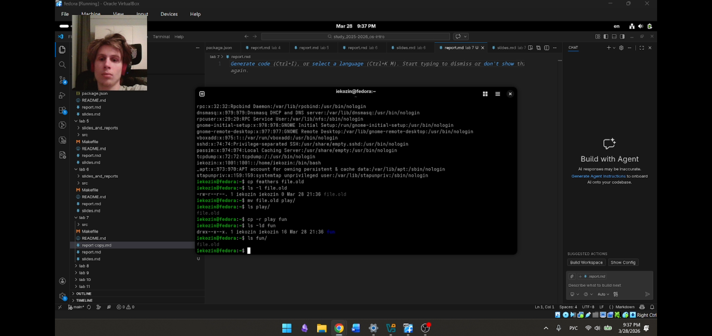

### 3.5 Перемещение `fun` в `play/games`
mv fun play/games
ls play/

 

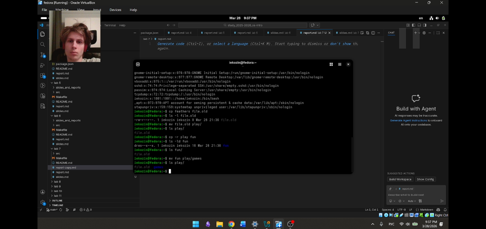

### 3.6 Лишение права на чтение файла `feathers`
chmod a-r feathers
ls -l feathers

 

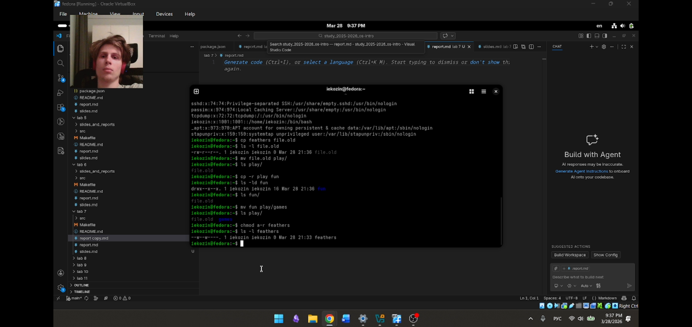

### 3.7 Попытка чтения `feathers`
cat feathers

 

Команда завершилась с отказом в доступе, что соответствует ожиданию.

### 3.8 Попытка копирования `feathers`
cp feathers feathers_copy

 

Также получен отказ в доступе.

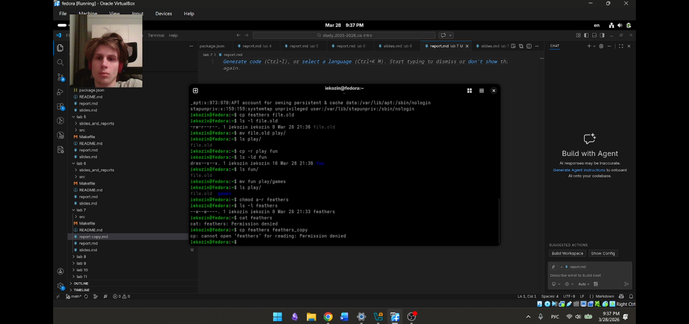

### 3.9 Возврат права на чтение `feathers`
chmod a+r feathers
ls -l feathers

 

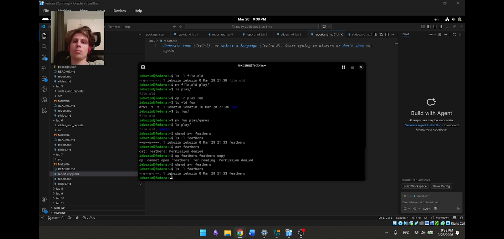

### 3.10 Лишение права на выполнение каталога `play`
chmod a-x play
ls -ld play

 

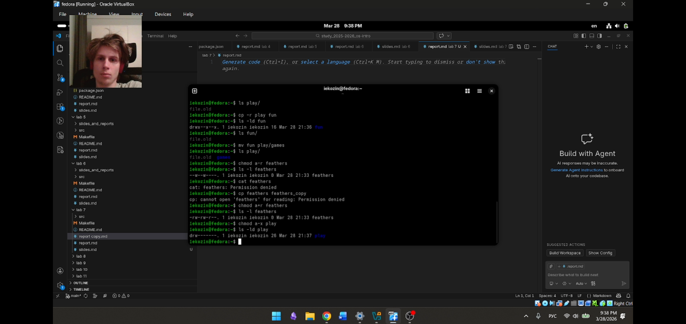

### 3.11 Попытка перехода в `play`
cd play

 

Команда не выполнена из-за отсутствия права `x`. Возврат в домашний каталог:
cd ~

 

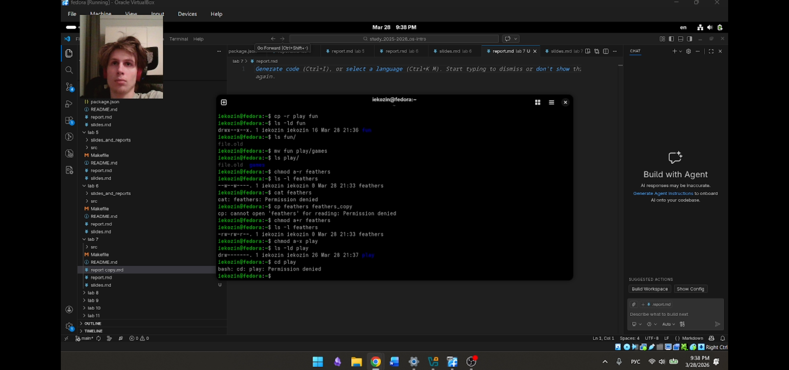

### 3.12 Возврат права на выполнение `play`
chmod a+x play
ls -ld play

 

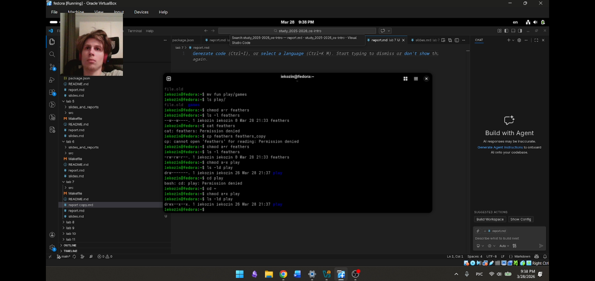

---

## 4. Анализ файловой системы

### 4.1 Просмотр смонтированных файловых систем
mount

 

Вывод содержит информацию о смонтированных устройствах, точках монтирования, типах ФС и параметрах.

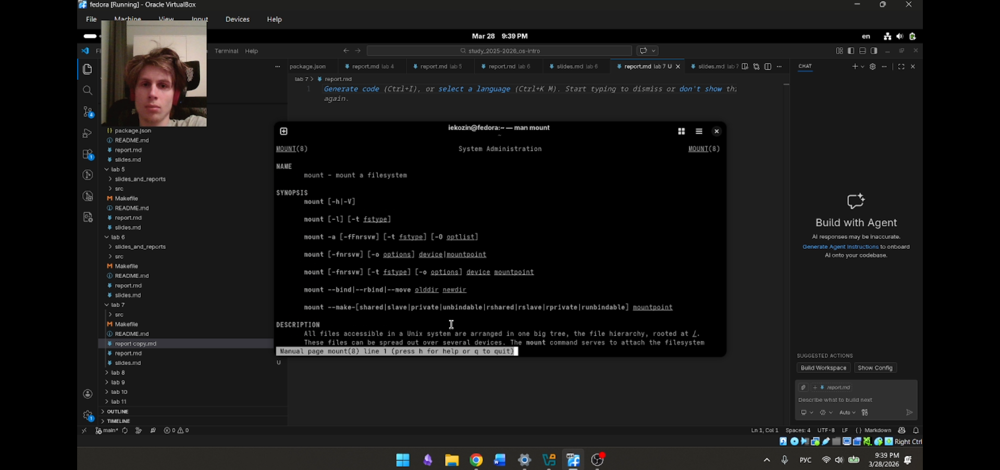

### 4.2 Просмотр файла `/etc/fstab`
cat /etc/fstab

 

Файл содержит описание автоматически монтируемых систем.

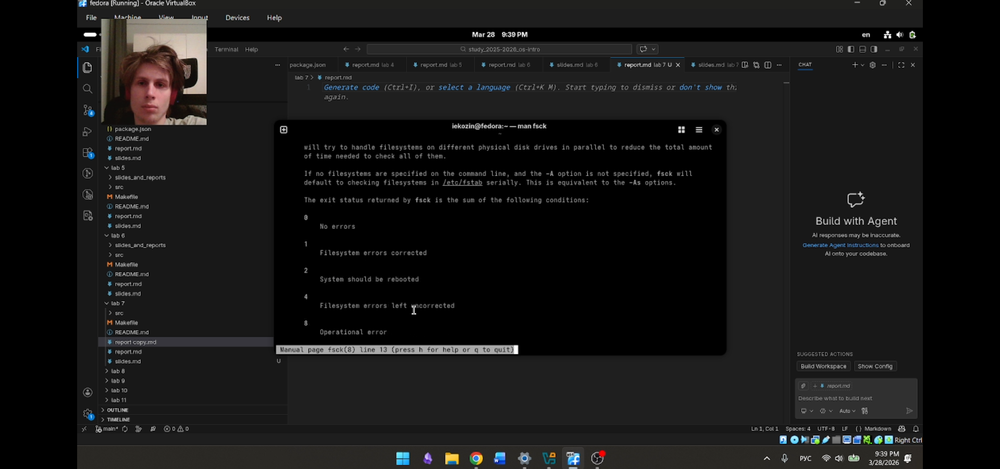

### 4.3 Проверка использования диска
df -h

 

Команда показывает занятое и свободное пространство на всех смонтированных ФС в удобном для чтения формате.

### 4.4 Изучение справочной информации

Для команд `mount`, `fsck`, `mkfs`, `kill` были просмотрены man-страницы:
man mount
man fsck
man mkfs
man kill

 

Краткое описание:

- **mount** — монтирование файловой системы; пример: `mount /dev/sdb1 /mnt/usb`
- **fsck** — проверка и восстановление файловой системы; пример: `fsck /dev/sda1`
- **mkfs** — создание файловой системы; пример: `mkfs.ext4 /dev/sdb1`
- **kill** — отправка сигнала процессу; пример: `kill -9 1234`

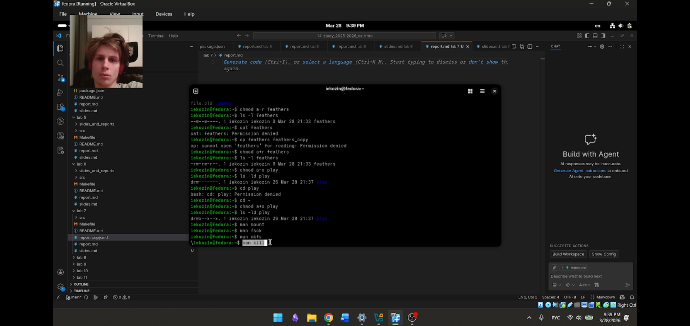

---

# Вывод

В ходе лабораторной работы были изучены основные команды для работы с файлами и каталогами в Linux. Получены практические навыки копирования, перемещения, переименования файлов и каталогов, а также изменения прав доступа. Проведён анализ смонтированных файловых систем и использование дискового пространства. Изучена справочная система `man` для углублённого понимания команд.

---

# Ответы на контрольные вопросы

**1. Дайте характеристику каждой файловой системе, существующей на жёстком диске компьютера, на котором вы выполняли лабораторную работу.**  
На моём компьютере используются файловые системы ext4 для корневого раздела и tmpfs для временных каталогов. Ext4 — журналируемая ФС, поддерживает большие файлы и разделы, обладает высокой производительностью. Tmpfs — размещается в оперативной памяти, используется для временных данных.

**2. Приведите общую структуру файловой системы и дайте характеристику каждой директории первого уровня этой структуры.**  
Корневой каталог `/` содержит следующие подкаталоги:  
- `/bin` — основные исполняемые файлы  
- `/boot` — загрузчик и ядро  
- `/dev` — файлы устройств  
- `/etc` — конфигурационные файлы  
- `/home` — домашние каталоги пользователей  
- `/lib` — системные библиотеки  
- `/media`, `/mnt` — точки монтирования съёмных и временных носителей  
- `/opt` — дополнительное программное обеспечение  
- `/proc`, `/sys` — виртуальные ФС с информацией о системе  
- `/root` — домашний каталог суперпользователя  
- `/sbin` — системные утилиты  
- `/tmp` — временные файлы  
- `/usr` — пользовательские программы и данные  
- `/var` — изменяемые данные (логи, очереди и т.п.)

**3. Какая операция должна быть выполнена, чтобы содержимое некоторой файловой системы было доступно операционной системе?**  
Файловая система должна быть смонтирована с помощью команды `mount` или автоматически при загрузке через записи в `/etc/fstab`.

**4. Назовите основные причины нарушения целостности файловой системы. Как устранить повреждения файловой системы?**  
Причины: некорректное завершение работы, сбой питания, ошибки оборудования, сбои драйверов. Устраняются с помощью команды `fsck` (проверка и восстановление) при отмонтированной ФС.

**5. Как создаётся файловая система?**  
Создаётся с помощью команды `mkfs` с указанием типа ФС и устройства, например `mkfs.ext4 /dev/sdb1`.

**6. Дайте характеристику командам для просмотра текстовых файлов.**  
- `cat` — выводит всё содержимое сразу, подходит для небольших файлов  
- `less` — постраничный просмотр с возможностью навигации  
- `head` — выводит первые строки (по умолчанию 10)  
- `tail` — выводит последние строки  

**7. Приведите основные возможности команды `cp` в Linux.**  
Копирование файлов и каталогов. Основные опции:  
- `-i` — запрос подтверждения перед перезаписью  
- `-r` или `-R` — рекурсивное копирование каталогов  
- `-v` — подробный вывод  
- `-p` — сохранение атрибутов (права, время)  

**8. Приведите основные возможности команды `mv` в Linux.**  
Перемещение и переименование файлов и каталогов. Опции:  
- `-i` — запрос подтверждения перед перезаписью  
- `-v` — подробный вывод  
- `-u` — перемещение только если исходный файл новее  

**9. Что такое права доступа? Как они могут быть изменены?**  
Права доступа определяют, какие действия (чтение, запись, выполнение) разрешены для владельца, группы и остальных. Изменяются командой `chmod` с символьным (например `u+x`) или восьмеричным (например `755`) форматом.

---

# Список использованных источников

1. Кулябов Д.С. и др. Операционные системы. Лабораторная работа №5.
2. Linux man pages.
3. Документация по командам терминала.